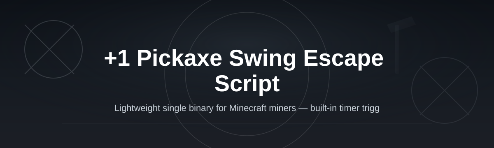
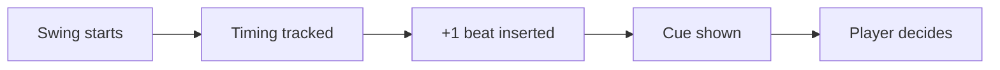

# mc-pickaxe-swing-escape

*A small, standalone tool that gives miners a clean "+1 pickaxe swing" window to escape mob attacks and cave-ins before they take damage.*

## What this is

**TL;DR: A standalone Windows utility that adds one extra pickaxe swing's worth of reaction time before you commit to a mining move, so you can back out of danger instead of walking into it.**

`mc-pickaxe-swing-escape` is a lightweight companion app built around one specific problem: in Minecraft, the moment between swinging your pickaxe and breaking through a block is often the moment a creeper, zombie, or lava pocket gets you. The "+1 Pickaxe Swing Escape Script" adds a single extra timing beat — a short, configurable pause reflected in an on-screen cue — that gives you enough time to see what's behind that block before you're standing next to it.

This isn't a mod, a texture pack, or a server plugin. It runs alongside the game as its own window, watching your swing timing and giving you a visual/audio nudge on the "+1" beat so you can pull back, block, or reposition. It's aimed at survival miners, cave explorers, and anyone who's ever mined straight into a mob spawn and paid for it with their inventory.

  

The button above opens the project's landing page, where you can download the current build.

## Who it is for

**TL;DR: Built for solo miners, cave divers, and anyone tired of losing gear to a surprise mob mid-swing.**

- Survival players who spend most of their playtime underground and want a beat of extra warning
- Speed-mining and "cave run" players who need reaction time without slowing their whole workflow
- Hardcore-mode players where one bad swing can end the run
- Streamers and content creators who want fewer clip-worthy deaths from avoidable mob ambushes
- Newer players still learning mob spawn patterns in caves and ravines

## What you can do

**TL;DR: Eight concrete things the tool actually does — no vague promises.**

- **Add a configurable extra beat** between your swing and the block break, giving you a moment to react
- **Show a visual cue** on screen so you know exactly when the "+1" window is active
- **Adjust timing sensitivity** to match your own reflexes and mining speed
- **Toggle on/off with a hotkey** without alt-tabbing out of the game
- **Run in the background** with minimal CPU/RAM footprint while you play
- **Log recent sessions** so you can review how often the extra beat actually helped
- **Save your preferred settings** between launches, no reconfiguration needed
- **Work across single-player and most LAN/local setups** without touching game files

## Getting started

**TL;DR: Visit the landing page, download the build, run it, and mine with a little more breathing room.**

1. Open the landing page using the button above.
2. Download the current release for Windows.
3. Extract the folder anywhere convenient (Desktop, Documents, etc.).
4. Launch the executable — no installer, no admin rights needed.
5. Start Minecraft, then use the in-app hotkey to toggle the escape cue on.

## Requirements

**TL;DR: Windows 10 or 11, nothing else to install.**

- Windows 10 or 11 (64-bit)
- No Java, Python, or build toolchain required
- No additional runtime installs — the app is standalone
- Roughly 50 MB of free disk space
- Minecraft running in windowed or borderless mode works best for the visual cue

## How it works

**TL;DR: It watches your swing timing, inserts one extra beat, and signals you before the block actually breaks.**

1. You start a mining action (left-click held on a block).
2. The app tracks the swing rhythm in real time.
3. On the final swing before the block would break, it inserts the "+1" pause.
4. A cue appears so you can decide: continue, retreat, or ready a weapon.
5. Once you act, the block break resumes on your next input.

## FAQ

**TL;DR: The questions people actually ask before trying this kind of tool.**

**Does this modify Minecraft's game files?**
No. It runs as a separate window alongside the game and does not touch your installation, saves, or jar files.

**Will this work with modded Minecraft or modpacks?**
It's built with vanilla survival mining in mind. It should run fine alongside most mods since it doesn't interact with game files, but results with heavily modified combat systems may vary.

**Does it work on servers, or only single-player?**
It works the same way regardless of server type, since it only reacts to your local swing timing — it doesn't send or read any network data.

**Is the extra swing beat noticeable or does it slow down mining?**
The delay is small and adjustable. Most testers describe it as barely noticeable during normal mining but clearly felt when a mob is nearby.

**Can I use this on Mac or Linux?**
Not currently. The 2026 build targets Windows 10/11 only.

## Troubleshooting

**TL;DR: Four common hiccups and their quick fixes.**

- **The cue doesn't appear in-game:** Make sure Minecraft is running in windowed or borderless mode, not exclusive fullscreen.
- **Hotkey doesn't toggle the feature:** Check for conflicts with other overlay apps (Discord, GPU software) and reassign the hotkey in settings.
- **App won't launch:** Confirm you extracted the full folder rather than running the executable from inside a zip.
- **Timing feels off:** Lower the sensitivity setting slightly — default values are tuned for average swing speed, not fast-clicking setups.

## License

Released under the [MIT License](LICENSE). This project is an independent utility and is not affiliated with or endorsed by Mojang or Microsoft. Use it at your own discretion within your game's terms of service.

  

